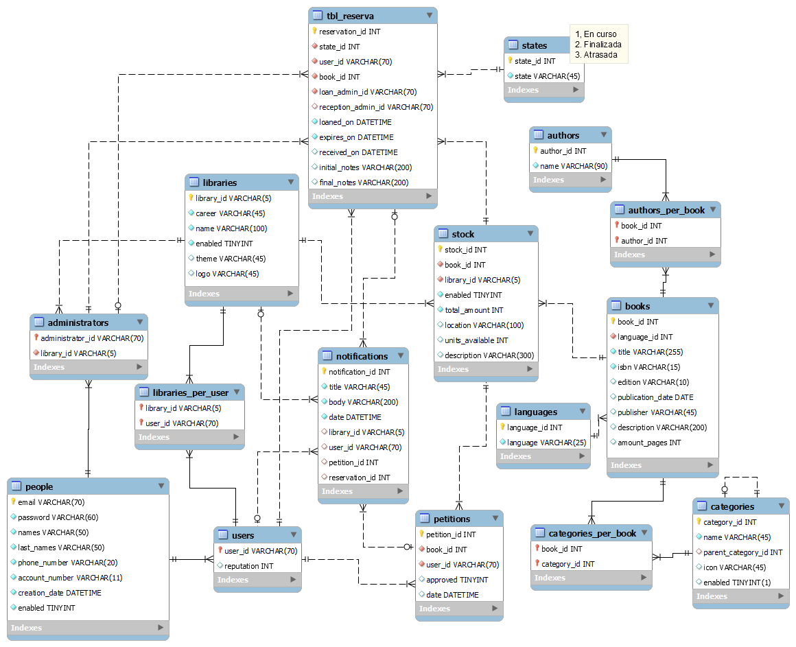
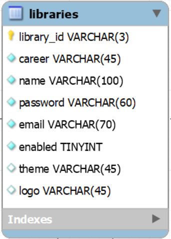

# Documentación tablas BD

<figure><figcaption></figcaption></figure>

### 1. Libraries

Cada carrera podrá tener una biblioteca. Esta tabla tiene los parámetros generales de la biblioteca, como el nombre y el tema.

<figure><figcaption></figcaption></figure>

### 2. People

En el sistema hay dos tipos de usuarios: administradores y usuarios normales (estudiantes). La tabla "people" tiene la información general de una persona. Las tablas "administrators" y "users" se derivan de esta tabla con una relación 1:1.

Se usurá el correo institucional como llave primaria (id) de los usuarios.

<figure><figcaption></figcaption></figure>

#### 2.1 Administrators

Su llave primaria es la llave foránea que proviene de la tabla "people". &#x20;

<figure><figcaption></figcaption></figure>

2.2 Users

Su llave primaria es la llave foránea que proviene de la tabla "people". A diferencia de los administradores (que solo pertenecen a una biblioteca) los usuarios pueden pertenecer a varias bibliotecas, por lo tanto la relación entre los usuarios y las bibliotecas es de muchos a muchos.

<figure><figcaption></figcaption></figure>

<figure><figcaption></figcaption></figure>

### 3. Books

A continuación se muestran todas las relaciones que involucran la creación de un libro.

<figure><figcaption></figcaption></figure>

### 4. Stock

Esta tabla relaciona los libros con las bibliotecas.&#x20;

<figure><figcaption></figcaption></figure>

### 5. Petitions

Antes de hacer un reservación los usuarios pueden hacer una petición donde el administrador evalúa si se prestará el libro o no. Al momento de aceptar o rechazar la petición se le envía una notificación al usuario (vía el sistema y email) el veredicto de la decisión y la información que respalda esta decisión.

* approved: va a ser 0 cuando no se apruebe la petición y 1 en caso contrario

<figure><figcaption></figcaption></figure>

### 6. Reservations

Después de que una petición fue aprobada, en el momento que el usuario va a traer el libro se genera una reserva con los siguientes campos:

* state\_id: determina el estado de la reserva (en curso, finalizada, atrasada ...)
* user\_id: correo del usuario
* book\_id: el id del stock al que hace referencia el libro prestado
* loan\_admin\_id: correo del administrador que prestó el libro
* reception\_admin\_id: correo del administrador que recibió el libro
* loaned\_on: fecha de inicio del prestamo
* expires\_on: fecha final del prestamo
* received\_on: fecha en que el usuario devolvió el libro
* initial\_notes: observaciones iniciales del libro
* final\_notes: observaciones del libro al momento de la devolución

<figure><figcaption></figcaption></figure>

### 7. Notifications

Las notificaciones se van a utilizar cuando se hacen, aprueban o desaprueban peticiones y para dar seguimiento a las reservas.

* Si es una notificación por alguna petición hecha por algún usuario estarán llenos los campos "library\_id" y "petition\_id"
* Si es una notificación informándole al usuario si se aprobó o no su petición estarán llenos los campos "user\_id" y "petition\_id"
* si es una notificación para informar al usuario sobre seguimiento de alguna reserva estarán llenos los campos "reservation\_id" y "user\_id"

<figure><figcaption></figcaption></figure>



